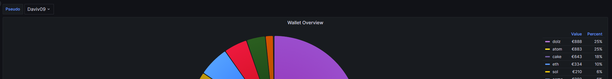

# SendWalletDisplay
This is simple python script who read json and send them to minotor

## How to use

### install python 

https://www.python.org/downloads/

### Get the code

#### from git

- install git (https://git-scm.com/book/en/v2/Getting-Started-Installing-Git)
- get code with git `git clone https://github.com/LaFermeDuMineur/SendWalletDisplay.git`

#### from source

- download source from https://github.com/LaFermeDuMineur/SendWalletDisplay/releases

### install dep

- go in folder SendWalletDisplay
- run command `pip install -r req.txt`

### Fill Json file

there is a file wallet.json as example, please create a file wallet.json at the same place with your own value.

````json
{
  "pseudo": "Daviv09", # Here put your username
  "wallet_overview": [
    {
      "token": "eth", # token name from coingecko
      "amount": 0.20 # Put your amount of the given token
    },
    {
      "token": "sol",
      "amount": 10
    },
    {
      "token": "atom",
      "amount": 80
    },
    {
      "token": "evmos",
      "amount": 550
    },
    {
      "token": "osmo",
      "amount": 260
    },
    {
      "token": "cake",
      "amount": 180
    },
    {
      "token": "dolz",
        "amount": 70000,
        "price": 0.01269 # If not on coigecko, please give the current price
    },
    {
      "token": "juno",
      "amount": 55
    },
    {
      "token": "stz",
        "amount": 2800,
        "price": 0.00094023 # If present and coingecko but rank is above 300, please give price too
    },
    {
      "token": "axl",
      "amount": 205
    }
  ]
}


````

## result you will get

````shell
201 [
    "eyJ0b2tlbiI6ImV0aCIsImFtb3VudCI6MSwidmFsdWUiOjE2ODIuMzYsInByaWNlIjowLCJwc2V1ZG8iOiJUaGVMdWMiLCJAdGltZXN0YW1wIjoiMjAyMy0wMy0yMlQxNzo1MzowNSswMTowMCJ9",
    "eyJ0b2tlbiI6ImF0b20iLCJhbW91bnQiOjU1LCJ2YWx1ZSI6NjAyLjgwMDAwMDAwMDAwMDEsInByaWNlIjowLCJwc2V1ZG8iOiJUaGVMdWMiLCJAdGltZXN0YW1wIjoiMjAyMy0wMy0yMlQxNzo1MzowNSswMTowMCJ9",
    "eyJ0b2tlbiI6ImJ0YyIsImFtb3VudCI6MC4wMSwidmFsdWUiOjI2Ny4xLCJwcmljZSI6MCwicHNldWRvIjoiVGhlTHVjIiwiQHRpbWVzdGFtcCI6IjIwMjMtMDMtMjJUMTc6NTM6MDUrMDE6MDAifQ==",
    "eyJ0b2tlbiI6InNvbCIsImFtb3VudCI6MTEsInZhbHVlIjoyMzIuMjA5OTk5OTk5OTk5OTgsInByaWNlIjowLCJwc2V1ZG8iOiJUaGVMdWMiLCJAdGltZXN0YW1wIjoiMjAyMy0wMy0yMlQxNzo1MzowNSswMTowMCJ9",
    "eyJ0b2tlbiI6ImF2YXgiLCJhbW91bnQiOjEzLCJ2YWx1ZSI6MjEzLjQ2MDAwMDAwMDAwMDA0LCJwcmljZSI6MCwicHNldWRvIjoiVGhlTHVjIiwiQHRpbWVzdGFtcCI6IjIwMjMtMDMtMjJUMTc6NTM6MDUrMDE6MDAifQ==",
    "eyJ0b2tlbiI6ImFhdmUiLCJhbW91bnQiOjMsInZhbHVlIjoyMTguMDEsInByaWNlIjowLCJwc2V1ZG8iOiJUaGVMdWMiLCJAdGltZXN0YW1wIjoiMjAyMy0wMy0yMlQxNzo1MzowNSswMTowMCJ9",
    "eyJ0b2tlbiI6ImVnbGQiLCJhbW91bnQiOjQuNSwidmFsdWUiOjE4MS41NzUwMDAwMDAwMDAwMiwicHJpY2UiOjAsInBzZXVkbyI6IlRoZUx1YyIsIkB0aW1lc3RhbXAiOiIyMDIzLTAzLTIyVDE3OjUzOjA1KzAxOjAwIn0=",
    "eyJ0b2tlbiI6Im1hdGljIiwiYW1vdW50IjoxMDAsInZhbHVlIjoxMDYuMSwicHJpY2UiOjAsInBzZXVkbyI6IlRoZUx1YyIsIkB0aW1lc3RhbXAiOiIyMDIzLTAzLTIyVDE3OjUzOjA1KzAxOjAwIn0=",
    "eyJ0b2tlbiI6ImxpbmsiLCJhbW91bnQiOjgsInZhbHVlIjo1Ni4wOCwicHJpY2UiOjAsInBzZXVkbyI6IlRoZUx1YyIsIkB0aW1lc3RhbXAiOiIyMDIzLTAzLTIyVDE3OjUzOjA1KzAxOjAwIn0="
]
````
## Get the result on grafana

The result will be displayed here https://mythologic.fr/d/iUkNs7BVk/wallet-overview?orgId=7

You just need to select your pseudo here



it's a searchbox, you can type in
